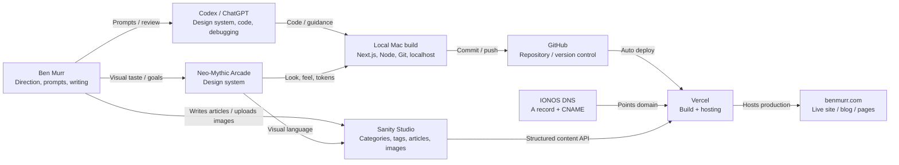

# Ben Murr Site Architecture

```mermaid
flowchart LR
    ben["Ben Murr<br/>Direction, prompts, writing"] -->|"Prompts / review"| ai["Codex / ChatGPT<br/>Design system, code, debugging"]
    ben -->|"Writes articles / uploads images"| sanity["Sanity Studio<br/>Categories, tags, articles, images"]
    ben -->|"Visual taste / goals"| design["Neo-Mythic Arcade<br/>Design system"]

    ai -->|"Code / guidance"| local["Local Mac build<br/>Next.js, Node, Git, localhost"]
    design -->|"Look, feel, tokens"| local
    design -->|"Visual language"| sanity

    local -->|"Commit / push"| github["GitHub<br/>Repository / version control"]
    github -->|"Auto deploy"| vercel["Vercel<br/>Build + hosting"]
    ionos["IONOS DNS<br/>A record + CNAME"] -->|"Points domain"| vercel
    sanity -->|"Structured content API"| vercel
    vercel -->|"Hosts production"| live["benmurr.com<br/>Live site / blog / pages"]
```
